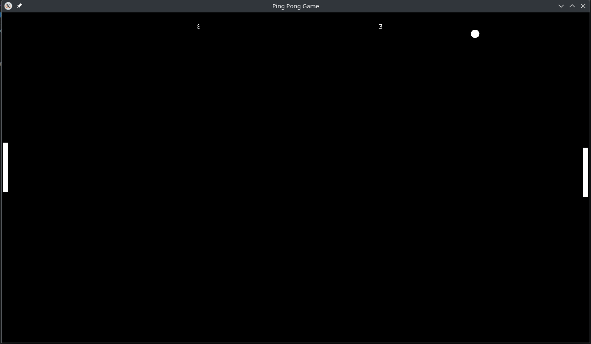

# ping-pong-c
Ping Pong game written in C

# Installation
install the following fedora packages or the equivalent to run or compile the game:
glfw-devel mesa-libGL-devel mesa-libEGL-devel libglvnd-opengl mesa-libGL-devel glfw glm-devel freetype-devel glad freeglut-devel mesa-libGLU-devel
## Compiling
run the make.sh shell script to compile!

